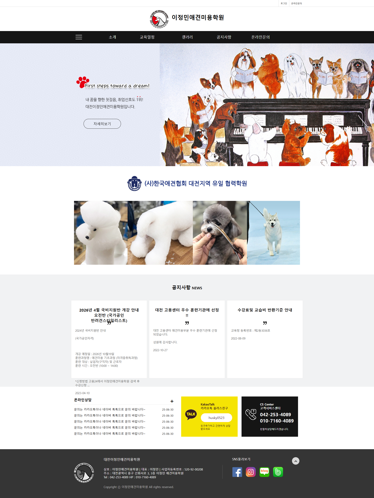

# 🐾 이정민 애견미용학원 웹사이트 리뉴얼


[](./LICENSE)

> 애견미용 교육과정 안내와 수강생 모집을 위한 교육기관 웹사이트 리뉴얼 프로젝트  
> 취업·자격증·창업을 준비하는 예비 수강생을 주요 타겟으로 합니다.

<br>

---

## 1. 📖 프로젝트 소개

이 프로젝트는 **이정민 애견미용학원**의 기존 웹사이트를 리뉴얼한 프로젝트입니다.  
기존 사이트는 핵심 강점 정보 노출 부족, 사용자 정보 탐색 동선 증가, 상담 전환 요소 부족 등의 문제가 있었습니다.  
**사용자 중심의 정보 구조 개편과 UI 개선**을 통해 상담 전환율을 높이는 것을 목표로 리뉴얼했습니다.

<br>

---

## 2. 📸 Before / After

<!-- 스크린샷을 assets/images/readme/ 폴더에 넣고 파일명을 맞춰주세요 -->

| Before | After |
|:---:|:---:|
|  |  |
| 기존 사이트 | 리뉴얼 사이트 |

<br>

---

## 3. ⚠️ 주의사항

> [!WARNING]
> - Firebase Auth와 네이버 지도 API는 `file://` 환경에서 정상 동작하지 않습니다. 반드시 Live Server 또는 로컬 서버 환경에서 실행해야 합니다.
> - Firebase 및 네이버 지도 API 키가 프론트엔드 코드에 포함되어 있습니다. 실서비스 배포 시 보안 환경 구성이 필요합니다.
> - 일부 이미지는 포트폴리오 제작 목적의 예시 이미지로 구성되어 있습니다.

<br>

---

## 4. 📋 프로젝트 정보

### 담당 역할

- 기획
- UI/UX 디자인
- 프론트엔드 개발
- 배포

### 작업 기간

| 구분 | 기간 |
|---|---|
| 전체 기간 | 2026.06.08 ~ 2026.07.01 |
| 기획 | 2026.06.08 ~ 2026.06.11 |
| 디자인 | 2026.06.11 ~ 2026.06.18 |
| 개발 | 2026.06.18 ~ 2026.07.01 |

### 기여도

| 이름 | 역할 | 기여도 |
|---|---|:---:|
| 추민석 | 기획, 디자인, 프론트엔드 | 100% |

<br>

---

## 5. 🛠️ 기술 스택

**Frontend**


**Database / Auth**


**외부 API**


**Library**


**Tools**


<br>

---

## 6. 🤖 AI 활용

### 사용한 AI 도구

| 도구 | 용도 |
|---|---|
| ChatGPT | 코드 작성 보조, 오류 해결, README 정리 |
| Claude | 코드 구조 검토 및 일부 구현 보조 |
| Gemini | 이미지 생성 및 시각 자료 제작 보조 |
| Figma | 와이어프레임 및 디자인 시안 제작 |

### AI 활용 내용

- Firebase Auth 이벤트 충돌 해결 방법 참고
- 반응형 레이아웃 그리드 구조 개선 제안 수용
- CSS 변수 및 BEM 네이밍 일관성 검토
- 웹페이지 구조 설계 검토

### 직접 구현한 내용

- 기존 사이트 분석 및 리뉴얼 기획 (문제점 도출 → 개선 방향 설정)
- 전체 UI/UX 설계 및 디자인 시스템 구축
- 페이지별 HTML/CSS 작성 및 반응형 레이아웃 구현
- Swiper 슬라이더 적용 및 커스텀 설정
- 네이버 지도 API 연동 및 현재 위치 기반 거리 계산
- Firebase 이메일 회원가입 / 로그인 / 구글 로그인 구현
- 로그인 모달, 회원가입 모달, TOP 버튼, 모바일 메뉴 구현

<br>

---

## 7. 🔗 프로젝트 링크

| 구분 | 링크 |
|---|---|
| 🌐 배포 사이트 | [바로가기](https://gmcms226-web.github.io/ljm/) |
| 🎨 기획서 (Canva) | [바로가기](https://canva.link/5qzd6oxqb1w9xog) |
| 🐙 GitHub | [바로가기](https://github.com/gmcms226-web/ljm) |

<br>

---

## 8. 🗺️ 프로젝트 개요

### 기존 사이트 문제점 분석

| 영역 | 문제점 |
|---|---|
| 메인페이지 | 핵심 강점 미전달, 히어로 이미지가 애견미용학원 정체성을 나타내지 못함 |
| 네비게이션 | 온라인문의 메뉴가 PC에서 동작하지 않음 |
| 교육일정 | 표 형태로만 나열되어 시각적으로 탐색이 어려움 |
| 갤러리 | 게시판 형태로 시각적 매력 부족, 콘텐츠 분류 불명확 |
| 공지사항 | 텍스트 중심 게시판으로 중요 공지 구분이 어려움 |

### 리뉴얼 방향

```
① 메인페이지에 핵심 정보를 섹션으로 배치 → 탐색 동선 단축
② 퀵메뉴 추가 → 주요 페이지 빠른 접근
③ 교육일정 카드형 UI + 스크롤 인터랙션 적용
④ 갤러리 슬라이더 UI + 카테고리 분류
⑤ 공지사항 카드형 UI로 중요 공지 우선 노출
⑥ 실시간 날씨 API 연동 → 동적 콘텐츠 추가
⑦ 발바닥 클릭 인터랙션 → 브랜드 경험 강화
```

<br>

---

## 9. ✨ 주요 기능

| 기능 | 설명 |
|---|---|
| 🔐 회원 인증 | Google 소셜 로그인 / 이메일 로그인·회원가입·비밀번호 찾기 |
| 🌤️ 실시간 날씨 | OpenWeatherMap API 연동, 대전 현재 날씨 30분 간격 자동 갱신 |
| 🗺️ 오시는 길 | 네이버 지도 임베드, 사용자 현재 위치 마커 및 거리 계산 |
| 🖼️ 슬라이더 | Swiper v11 기반 실습 사진·시설·갤러리 리뷰 다중 슬라이더 |
| 🐾 인터랙션 | 클릭 시 발바닥 이펙트 — 학원 브랜드 경험 강화 |
| ⚡ 퀵메뉴 | 우측 고정 바로가기 메뉴로 탐색 동선 단축 |
| 💬 상담 신청 | 코스 선택 + 정보 입력 → 확인 모달 (UI 확인 전용) |
| 📱 반응형 | 모바일·태블릿·데스크탑 전 해상도 대응 |

<br>

---

## 10. 💡 핵심 구현 내용

### Firebase 인증 모듈 (ES Module)

```javascript
// Google OAuth 팝업 로그인 + Firestore 사용자 저장
async function loginWithGoogle() {
  const result = await signInWithPopup(auth, provider);
  await setDoc(doc(db, 'users', result.user.uid), {
    name: result.user.displayName,
    email: result.user.email,
    createdAt: new Date()
  }, { merge: true });
}
```

### 네이버 지도 + 현재 위치 거리 계산

```javascript
// Haversine 공식으로 사용자 위치 → 학원 거리 계산
function getDistance(lat1, lng1, lat2, lng2) {
  const R = 6371;
  const dLat = (lat2 - lat1) * Math.PI / 180;
  const dLng = (lng2 - lng1) * Math.PI / 180;
  const a = Math.sin(dLat/2) ** 2 +
            Math.cos(lat1 * Math.PI / 180) * Math.cos(lat2 * Math.PI / 180) *
            Math.sin(dLng/2) ** 2;
  return R * 2 * Math.atan2(Math.sqrt(a), Math.sqrt(1 - a));
}
```

### 갤러리 스크롤 애니메이션

```javascript
// IntersectionObserver로 스크롤 시 갤러리 아이템 순차 등장
const observer = new IntersectionObserver((entries) => {
  entries.forEach(entry => {
    if (entry.isIntersecting) entry.target.classList.add('is-visible');
  });
}, { threshold: 0.1 });
```

<br>

---

## 11. 🐛 Trouble Shooting

<details>
<summary><b>로그인 상태에서 헤더 버튼 클릭 시 모달이 함께 열리는 문제</b></summary>

**문제**  
로그인 상태에서 헤더 버튼 클릭 시 로그아웃 처리와 동시에 `common.js`의 로그인 모달 오픈 리스너가 중복 실행됨.

**원인**  
`common.js`와 `firebase-auth.js` 두 파일이 동일한 버튼에 이벤트 리스너를 등록하여 이벤트 버블링으로 중복 실행.

**해결**  
로그아웃 핸들러에 캡처 페이즈(`capture: true`) + `stopImmediatePropagation()` 적용.

```javascript
loginBtn.addEventListener('click', handleLogout, true);
function handleLogout(e) {
  e.stopImmediatePropagation();
  signOut(auth);
}
```

</details>

<details>
<summary><b>Swiper 아카데미 슬라이더 슬라이드 수 불일치 오류</b></summary>

**문제**  
아카데미 시설 슬라이더에서 일부 슬라이드가 표시되지 않거나 빈 슬라이드가 생성됨.

**원인**  
`swiper-init.js`의 `academyData[]` 배열 항목 수와 HTML `swiper-slide` div 수가 불일치.

**해결**  
`academyData` 배열(11개)과 HTML 슬라이드(11개)를 동기화.

</details>

<br>

---

## 12. ⚡ 성능 최적화

- **CSS 분리 로드** — 페이지별 필요한 CSS만 `<link>`로 로드하여 초기 렌더링 속도 개선
- **API 호출 최소화** — 날씨 API 30분 간격 호출로 불필요한 네트워크 요청 절감
- **IntersectionObserver** — 스크롤 이벤트 대신 사용하여 갤러리 애니메이션 성능 향상
- **이미지 object-fit** — `object-fit: cover/contain` 적용으로 레이아웃 시프트(CLS) 방지

<br>

---

## 13. 🗄️ 데이터 구조

### Firestore `users` 컬렉션

```json
{
  "uid": "string (Firebase Auth UID)",
  "name": "string",
  "phone": "string",
  "email": "string",
  "createdAt": "timestamp"
}
```

<br>

---

## 14. 📁 프로젝트 구조

```
ljm/
├── index.html
├── about.html
├── notice.html
├── notice-01.html
├── notice-02.html
├── notice-03.html
├── gallery.html
├── location.html
├── favicon.png
└── assets/
    ├── css/
    │   ├── common.css         # CSS 변수 전역 정의 (색상·폰트·간격)
    │   ├── header.css / footer.css
    │   └── ...                # 페이지·섹션별 스타일
    ├── js/
    │   ├── common.js          # 전 페이지 공통 (햄버거, 탑버튼, 발바닥 인터랙션 등)
    │   ├── firebase-auth.js   # 인증 모듈 (ES Module)
    │   ├── swiper-init.js     # 홈 슬라이더
    │   ├── gallery.js         # 갤러리 슬라이더 + 스크롤 애니메이션
    │   ├── weather.js         # 날씨 API
    │   └── location-map.js    # 네이버 지도
    └── images/
        ├── pracitce/          # 홈 실습 슬라이더
        ├── academy/           # 시설 슬라이더
        ├── gallery/           # 갤러리 그리드
        └── teachers/          # 강사 프로필
```

<br>

---

## 15. ▶️ 실행 방법

```bash
# 1. 저장소 클론
git clone https://github.com/gmcms226-web/ljm.git

# 2. 디렉토리 이동
cd ljm

# 3. 로컬 서버 실행
npx serve .
```

> VS Code **Live Server** 익스텐션으로도 실행할 수 있습니다.  
> `file://`로 직접 열면 Firebase Auth와 네이버 지도가 동작하지 않습니다.

<br>

---

## 16. 🔧 개선 예정

- [ ] 챗봇 기능 구현 — 국비지원·교육과정·수강 혜택 정보 즉시 제공
- [ ] 공지사항 관리자 CMS 연동 (현재 HTML 하드코딩)
- [ ] 상담 신청 폼 실제 데이터 전송 기능 구현
- [ ] Lighthouse 성능 점수 90점 이상 달성

<br>

---

## 17. 📚 프로젝트를 통해 배운 점

- 기존 사이트를 분석하고 문제점을 도출한 뒤 리뉴얼 방향을 설계하는 기획 프로세스 경험
- Firebase ES Module 방식의 트리쉐이킹 구조와 `type="module"` 스크립트의 자동 defer 동작 원리 이해
- BEM 방법론을 실제 프로젝트 전체에 일관성 있게 적용하는 경험
- 이벤트 버블링·캡처 페이즈 차이를 실무 문제 해결에 활용
- CSS 변수 기반 디자인 시스템이 유지보수에 얼마나 효과적인지 체감

<br>

---

## 18. 💬 프로젝트 회고

| 구분 | 내용 |
|------|------|
| **프로젝트 목표** | 실제 운영 중인 애견미용학원 웹사이트를 분석하여 사용자 입장에서 불편한 정보 구조와 화면 흐름을 개선하고, 필요한 기능을 기획부터 디자인, 구현, 수정까지 직접 진행하는 것을 목표로 했습니다. |
| **진행 과정** | 페이지 구조 설계, UI 디자인, HTML/CSS 구현, 반응형 제작, Swiper 슬라이더, Firebase Auth, 네이버 지도 API 연동 등 기능을 단계적으로 구현했습니다. 개발 과정에서는 ChatGPT, Claude, Gemini 등 AI 도구를 활용하여 오류를 분석하고 해결하며 기능을 완성했습니다. |
| **잘한 점** | 단순히 화면을 구현하는 것에 그치지 않고 실제 사용자의 동선을 고려하여 페이지를 재구성했습니다. 또한 여러 페이지를 공통 컴포넌트 형태로 관리하고, Firebase 로그인과 지도 API 등 외부 서비스를 직접 연동하면서 프로젝트의 완성도를 높일 수 있었습니다. |
| **아쉬운 점** | 프로젝트 초기에 컬러 시스템과 폰트 규칙을 충분히 정의하지 않아 후반부에 전체 색상과 디자인을 다시 수정하는 시간이 많이 소요되었습니다. 또한 기획 단계에서 **포메팀장 AI 챗봇 기능**까지 구현하는 것을 목표로 했지만, 로그인 기능과 반응형 작업, 페이지 구현에 많은 시간이 소요되어 이번 프로젝트에서는 적용하지 못한 점이 아쉬웠습니다. |
| **배운 점** | 디자인 시스템을 먼저 구축한 뒤 개발을 진행하는 것이 유지보수에 훨씬 효율적이라는 점을 체감했습니다. 또한 AI를 단순히 코드를 생성하는 도구가 아니라, 문제를 해결하고 구현 방식을 비교·검토하는 개발 보조 도구로 활용하는 경험을 쌓을 수 있었습니다. |
| **다음 프로젝트에서 개선할 점** | 프로젝트 초기에 컬러 팔레트, 폰트, 컴포넌트 규칙을 먼저 설계하고 개발을 시작할 계획입니다. 또한 이번에 구현하지 못한 **포메팀장 AI 챗봇 기능**과 관리자 기능(CMS), 상담 신청 데이터 저장 기능 등을 추가하여 실제 서비스 수준의 웹사이트로 발전시키고 싶습니다. |

<br>

---

## 19. 📄 License

```
MIT License

Copyright (c) 2025 추민석

Permission is hereby granted, free of charge, to any person obtaining a copy
of this software and associated documentation files (the "Software"), to deal
in the Software without restriction, including without limitation the rights
to use, copy, modify, merge, publish, distribute, sublicense, and/or sell
copies of the Software, and to permit persons to whom the Software is
furnished to do so, subject to the following conditions:

The above copyright notice and this permission notice shall be included in all
copies or substantial portions of the Software.
```

---

<div align="center">

Made with ❤️ by [추민석](https://github.com/gmcms226-web)

</div>
